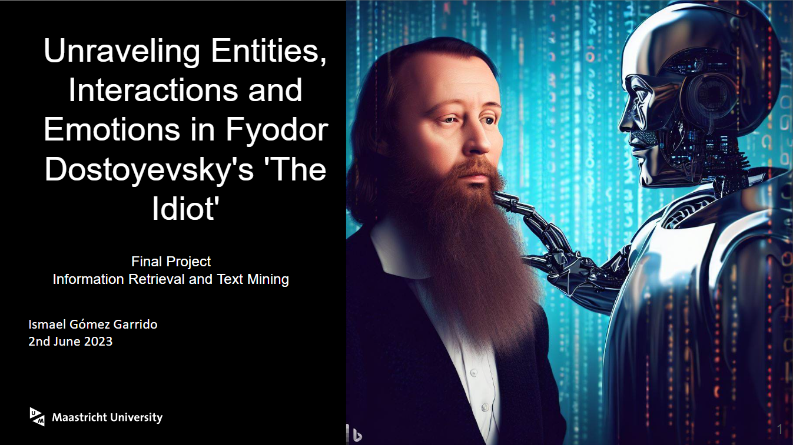

# analyzing_the_idiot

This project was part of the Information Retrieval and Text MIning course from Maastricht University

This report is based on an information extraction process over the Dostoyevsky’s novel ‘The Idiot’,
Before any information extraction it was necessary to preprocess the data. This preprocessing included
tasks like the separation of the book into chapters, tokenization, Named Entity Recognition (NER) and
entity unification. After that, three different visualizations were made with the intention of extracting
valuable information: counting of character appearances (pure count and tf-idf score), estimation of
the characters’ interactions with each other and text classification into the main 7 emotions (6 from
Ekman + neutral). For the text classification 3 pretrained BERT based models were used and its
performance was calculated by the accuracy on a random subset of paragraphs manually annotated.
After analyzing the results, the visualizations helped to understand the characters importance in the
book along the chapters. However, further research is possible to achieve better results.

Key words: Text Mining, Information Retrieval, NER, text classification, BERT

* The notebook contains all the preprocessing, analysis and visualizations made for the process
* The pdf is the full report of the project, it contains all the visualizations and conclusions from the project
* entities.xlsx -> List of the entities extracted before the normalization with the number of appearances in the book
* interactions.xlsx -> NUmber of interactions measured by characters with different window sizes, is the file used in Flourish Studio
* the_idiot_raw.txt -> Text file with the book once manually removed the introduction and some license information

